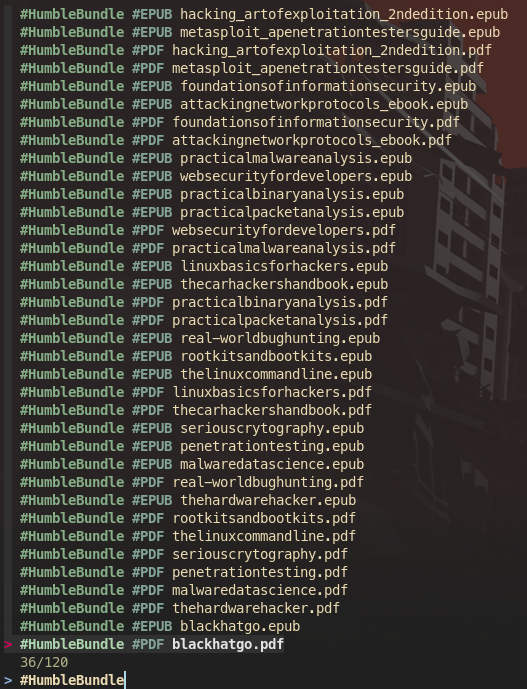

# Organize your books (or everything) with this simple script

When I started having several books and documents on my computer I decided to create a simple script to navigate through them. At first I was dividing them into folders, but then folders became sub-folders and now it is growing bigger and bigger. Thus, I needed some faster way to find that particular document or book that I wanted to consult. I knew of the `fzf` program and decided to use it as a fuzzy finder for my files, here is the script:

```
#!/bin/sh

WD="$(pwd)"
cd "$HOME/Books"
# Get all the books and use the directories and sub-directories as tags
BOOK="$(find . | grep -e epub -e pdf -e html | awk -F"/" '{for (i=2; i<NF; i++) printf "\033[1;34m#" $i "\033[0m" " "; print $NF }' | fzf --ansi)"
# Get only the book name (the words not starting with the character #)
BOOK="$(echo "$BOOK" | sed 's/#[A-Za-z0-9]* //g')"
if [ "$BOOK" ]; then 
	PATH="$(find . -name "$BOOK")"
	/bin/nohup /bin/zathura "$PATH" >/dev/null 2>&1 &
fi
cd "$WD"
```

The first line stores the current working directory and then changes it to the one where I store my books and documents. With `find . | grep -e epub -e pdf -e html` I search for documents with *epub*, *pdf* or *html* extensions. The following commands is the interesting part of the program:

```
awk -F"/" '{for (i=2; i<NF; i++) printf "\033[1;34m#" $i "\033[0m" " "; print $NF }'
```

I decided to use the current structure of folders and sub-folders as searchable tags for my books. Therefore, the previous line of code splits the words in the path and prints them with a trailing character `#` and colored with blue. In this way it is easy to recognize which ones are the tags and which ones are the file titles, as shown below, where the output is passed to the `fzf` program:



The main problem is that once a book is selected with fzf, the output is returned as described above. Therefore, I used sed to remove all the tags (the current implementation assumes that the character `#` is not present in the name of a book) and searches for the book name in the current directory. As I am writing this post I realize that two books should not have the same name, therefore I will need to update the script in the future. Once the book is found, the path is copied in a variable and passed to `zathura` to open it. At the end, the current directory is restored to the one where the script was invoked from.

This script is very simple and there are a lot of improvements that can be done, however, it is very useful and functional for my current needs. If you have some suggestions, feel free to ping me on Twitter (@paolo_prem). I will probably do a part 2 in the future with some improvements to this script.

;tags: linux scripting
