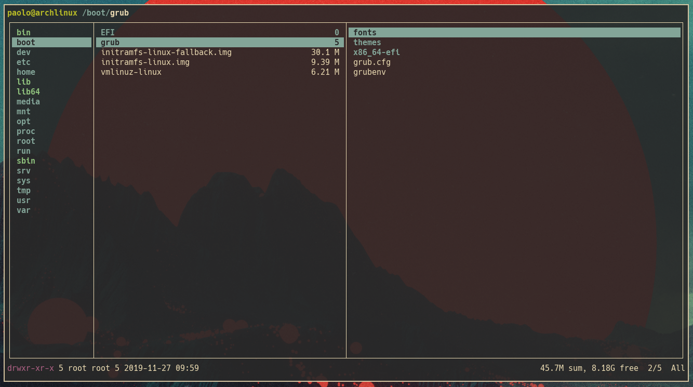
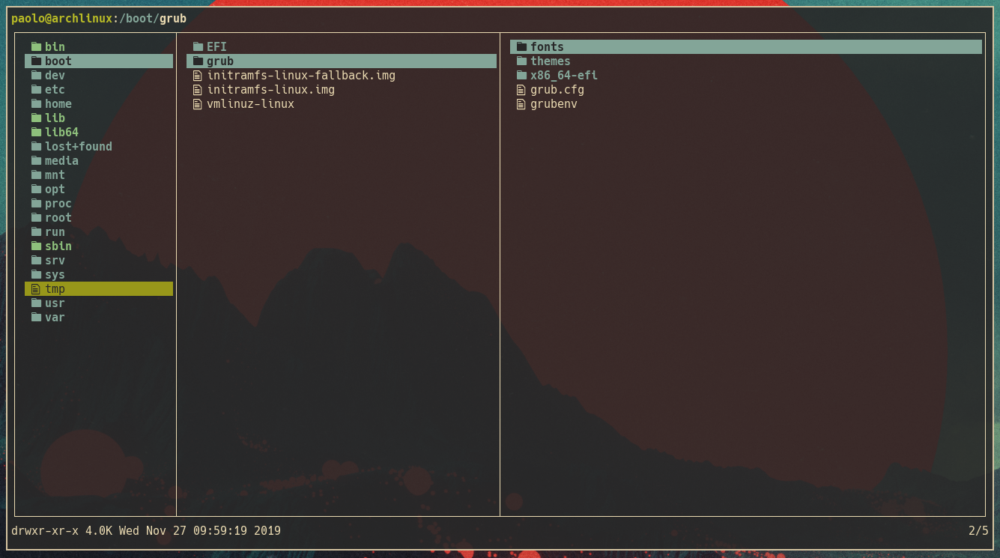
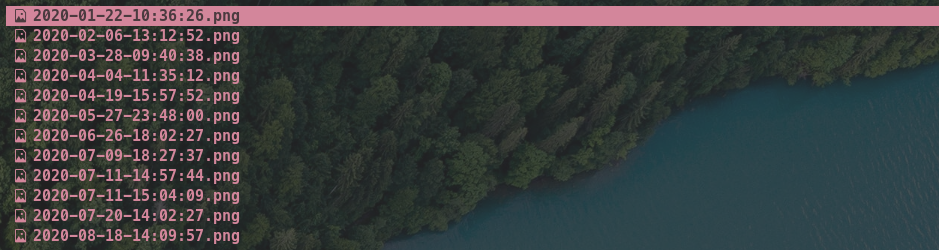

Lf, the perfect terminal file manager

When I first saw [Ranger](https://github.com/ranger/ranger), I immediately loved it. You can manage your files entirely from your command line in an awesome way. Here is a screenshot of its interface:



Its biggest flaw? Python!

I started using it instead of the `cd` command to navigate through my filesystem and I noticed an incredibly annoying delay of 1/2 seconds before it would open. This is the reason I started to look for some faster alternatives. I tried [vifm](https://github.com/vifm/vifm) and [nnn](https://github.com/jarun/nnn) but then I found [lf](https://github.com/gokcehan/lf), a file manager written in go. Not only it is faster than ranger, but it also looks very similar. Here is a screenshot of its interface:



By default, when you close lf with the *q* key, it doesn't exit in the current directory, but it returns to the one where you ran it. Since I am	using it to navigate into my filesystem, I searched in their documentation how to	add this functionality. They provide a snippet of code that keeps track of the current directory and automatically `cd` into that. Here is the snippet:
```
lfcd () {
  tmp="$(mktemp)"
  /bin/lf -last-dir-path="$tmp" "$@"
  if [ -f "$tmp" ]; then
      dir="$(cat "$tmp")"
      rm -f "$tmp"
      if [ -d "$dir" ]; then
          if [ "$dir" != "$(pwd)" ]; then
              cd "$dir"
          fi
      fi
  fi
}
```
Therefore, I created a new file, called *lfcd* and I sourced it in my *.zshrc* (if you use bash, source it in you *.bashrc*):
```
source "/path/to/my/lfcd/file/lfcd.sh"
```
In this way I was able to navigate my filesystem only using lf. Nice! So, I was thinking, is there something that I can do with a GUI file manager that I cannot do with my current configuration of lf? And two things came to my mind:

- Drag and drop
- Manage pictures and photos

    For the first thing I did a quick search on Google and found an awesome project called [dragon drag and drop](https://github.com/mwh/dragon) that could create from the command line a simple window with the selected file/s to drag and drop. I immediately downloaded it and imlemented it into my configuration of lf adding the following snippet of code to the lfrc config file:
```
# Open drag and drop with t
map t $dragon-drag-and-drop -a -x $fx &
```
In this way, using the *t* key, I can create a window with all the selected files and easily drag and drop them into any applications that support this functionality.

For the other task, i.e. managing photos and pictures, I thought at first that the most effective way to do that was to implement any sort of image preview within the terminal and within lf. Fortunately, I was wrong, the most simple and effective way was to use a program called [sxiv](https://github.com/muennich/sxiv). It's a simple image previewer that has a lot of potential, including custom scripts to execute on certain key combination. Maybe I will write another article only about that, for the moment I would just stick with the configuration with lf starting with an example.

Let's say I have some pictures named with the time and date they are taken, like it is shown in the picture below:



My first approach was closing lf, opening sxiv with all the pictures in the target folder, chose the one I wanted to edit/move and then remember the name to be sure I selected the right picture. This operation was much simpler using a GUI file manager where you just select the one you are interested in. I couldn't accept it and therefore, I informed myself on both lf and sxiv and after some tries I found the perfect combination, and this was achieved by adding the following line to my `lfrc`:
```
# Open all images in current folder in sxiv and select marked image
map L $lf -remote "send $id select '$(sxiv -o .*)'"
```
Let's start with the first command executed, i.e. `sxiv -o .*`. This command simply opens sxiv with the `-o` option in the current folder with all the files it is able to process (images). The specified option is used to *"write list of all marked files to standard output when quitting"*, as also mentioned in its man page. When using sxiv, you can mark an image by simply pressing the *m* key. Then, when you quit sxiv, its name is printed in the standard output. An example is shonw in the gif below:


The name is then processed by the second command `lf -remote "send $id select 'name-of-marked-file'"`. Lf has a running server in the background and differentiates the different instances using ids. With the previous command we are telling the server (using the *lf -remote*) to make the instance identified by *\$id* to select the file corresponding by the last string. By default, every instance of lf has its id stored into the *\$id* variable, accessible only inside the *lfrc* configuration file.

TL;DR In this way I can open sxiv with all the images in a folder by pressing *L* inside lf and then selecting on lf the marked image when quitting sxiv.

;tags: linux
